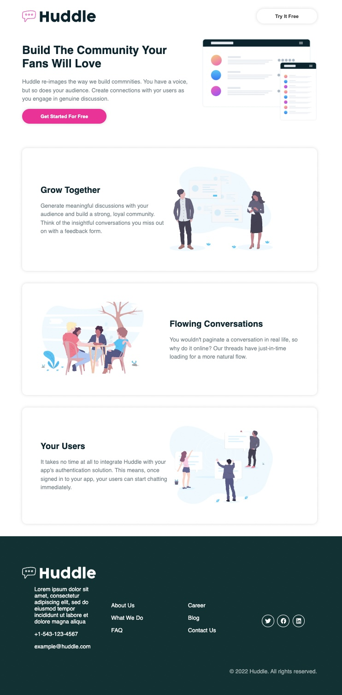
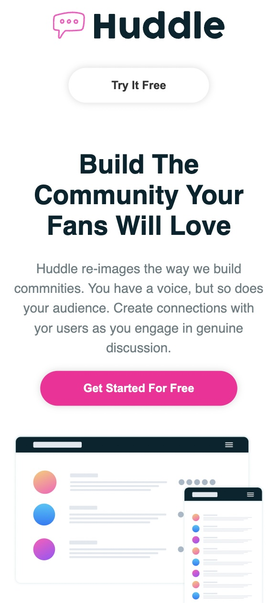

# Huddle - single page responsive styling using styled-components

## General Information
This project is used to practice styled components with a majority of containerized styling to each component and one global theme provider. 

   

## Technologies used
* React, styled components
* HTML & CSS
* Git v2.33.1 Mac
* Visual Studio Code v1.62.3

## Features
### Implemented
* Dynamic styling of flex rows based on id
* Use of global theme styling

### Future Development Ideas
* Increase responsive range of devices
* Include more pages to explore more styling

